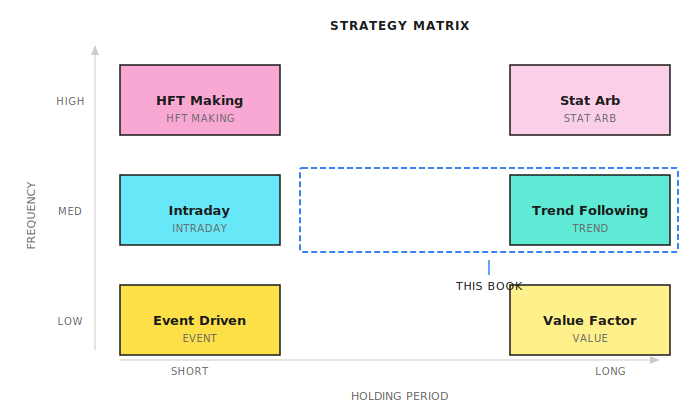
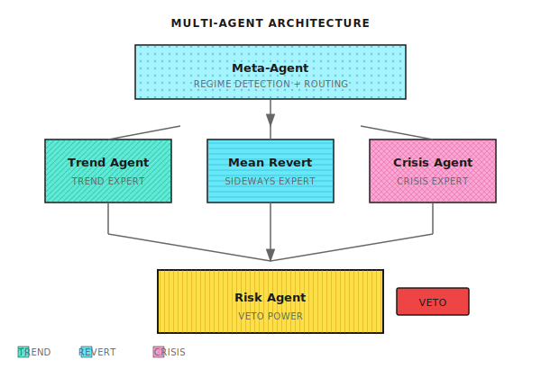
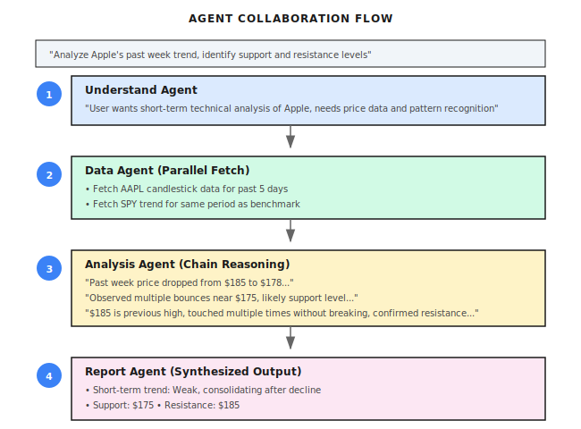
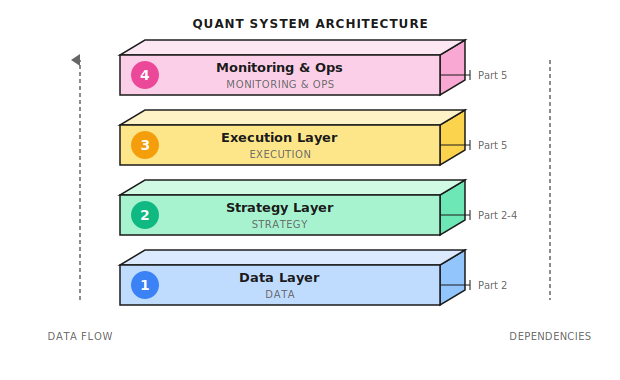
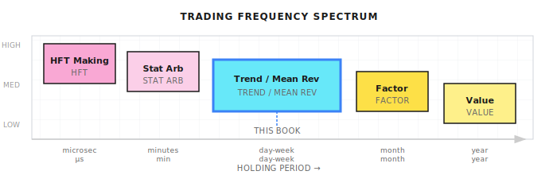
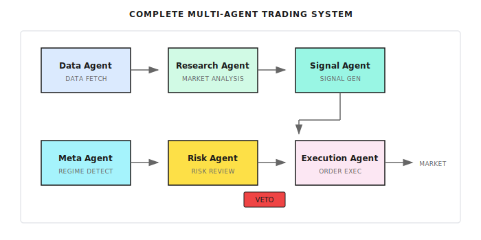
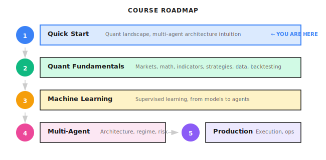

# Lesson 01: The Complete Landscape of Quantitative Trading

> **Goal**: Establish a global perspective first, then dive into details. Understand who the players are in the quantitative world, what strategies exist, why multi-agent architecture is needed, and where this book focuses.

---

## A Typical Scenario (Illustrative)

> Note: The following is a synthesized example to illustrate common phenomena; the numbers are illustrative and do not correspond to any specific individual/account.

In 2020, a quantitative trader developed a machine learning-based strategy for US stocks, primarily trading S&P 500 constituents. The backtest returns were impressive: 80% annualized return, Sharpe ratio of 2.5.

He confidently invested $500,000.

For the first two months, the strategy performed perfectly—going long with the market's upward trend, the account grew 30%. Then the market entered a sideways period, and the strategy started getting whipsawed repeatedly: chasing highs and selling lows, always buying at peaks and selling at troughs. Three months later, the account had drawn down 40%.

He tried adjusting parameters to make the strategy better suited for sideways markets. The result? When the next trend came, the strategy perfectly missed it.

**What went wrong?** It wasn't that the model wasn't good enough, but rather that **a single model cannot excel in all market regimes simultaneously**. Trending markets need momentum strategies, sideways markets need mean reversion, and crisis markets need risk control first. This is a structural contradiction, not something parameter tuning can solve.

But before discussing solutions, let's first establish a comprehensive understanding of quantitative trading.

---

## 1.1 Three Tiers of Quantitative Trading

When people hear "quantitative trading," different images come to mind:

- **Retail traders** think: Write a Python strategy, automate buying and selling stocks, make money while sleeping
- **Programmers** think: High-frequency trading, nanosecond latency, FPGA, colocation
- **Finance professionals** think: Factor models, risk parity, Smart Beta

They're all talking about "quant," but they're not talking about the same thing at all.

### Classification by Capital Scale and Competitive Dimension

| Tier | Typical Capital | Core Competitive Advantage | Representative Players |
|------|-----------------|---------------------------|------------------------|
| **Tier 1: HFT Market Making** | $1B+ | Speed (microsecond-level), hardware, exchange relationships | Citadel Securities, Virtu, Jump |
| **Tier 2: Institutional Quant** | $100M-$10B | Research depth, factor mining, risk control systems | Two Sigma, DE Shaw, High-Flyer, Jiukun |
| **Tier 3: Small/Individual** | <$100M | Flexibility, niche markets, execution discipline | Small hedge funds, proprietary traders |

### Tier 1: HFT Market Making (Opponents You Can't Beat)

**What they do**: Profit from the bid-ask spread, provide liquidity, exploit microsecond information advantages for arbitrage, execute millions of trades per day earning pennies per trade.

**Why you can't beat them**:
```
Your order latency: 50-100 milliseconds (normal network)
Their latency: 5-50 microseconds (exchange colocation)
Difference: 1,000-10,000x
```

When you see a "good price" and prepare to place an order, they've already completed 1,000 trades.

> **Conclusion**: Unless you have hundreds of millions in capital and a top-tier technical team, don't touch HFT. This is an arms race where retail traders always lose.

### Tier 2: Institutional Quant (This Book's Learning Objective)

**What they do**: Medium to low-frequency strategies (holding hours to weeks), multi-factor models, statistical arbitrage, event-driven strategies, strict risk control and portfolio management.

**Why it's worth learning**:
- No speed advantage needed, wins through strategy and risk control
- Methodology is replicable and suitable for systematic learning
- Main application scenario for multi-agent architecture

### Tier 3: Small/Individual

**Advantages**: High flexibility, can pursue small-capacity strategies that big institutions ignore, low cost of experimentation

**Disadvantages**: Limited data and research resources, prone to emotional trading, lack of systematic risk control

**This book's positioning**: Help you build systems using institutional-grade methodology at individual/small team scale.

---

## 1.2 Major Strategy Types

### Strategy Classification Map



### Six Major Strategy Types

| Strategy Type | Core Logic | Holding Period | Difficulty |
|---------------|------------|----------------|------------|
| **HFT Market Making** | Profit from bid-ask spread, provide liquidity | Seconds-minutes | ★★★★★ |
| **Statistical Arbitrage** | Related assets' price spread reversion | Minutes-days | ★★★★ |
| **Trend Following** | Price momentum persistence | Days-weeks | ★★★ |
| **Mean Reversion** | Price deviation followed by reversion | Hours-days | ★★★ |
| **Event-Driven** | Earnings, M&A, and other events | Days-months | ★★★★ |
| **Multi-Factor** | Combine multiple Alpha factors | Weeks-months | ★★★★ |

### Strategy Lifecycle

**Key insight**: No strategy works forever.

```
Discovery → Validation → Deployment → Decay → Retirement
```

Your system must be able to **continuously evolve**—this is why we need multi-agent architecture.

---

## 1.3 Why Multi-Agent Architecture

Let's return to the opening story: Why did the single model fail?

### Fatal Flaws of Single Models

Markets switch between different regimes:

| Market Regime | Best Strategy | Single Model Problem |
|---------------|---------------|---------------------|
| **Trending** | Momentum: ride the trend | Gets whipsawed in sideways markets |
| **Sideways** | Mean reversion: buy low, sell high | Misses big moves in trending markets |
| **Crisis** | Risk control first: reduce exposure | May hold full position during crashes |

**Core problem: A single model cannot excel in all regimes simultaneously.** This is a structural flaw, not something parameter tuning can fix.

### Multi-Agent Solution Approach



**Three Core Design Principles:**

1. **Expert Specialization**: Different agents handle different market regimes, each excelling in their domain
2. **Dynamic Routing**: Meta-Agent determines current market regime and routes tasks to corresponding experts
3. **Independent Risk Control**: Risk Agent has veto power—any expert's recommendation must pass risk control

### Common Misconceptions

| Misconception | Reality |
|---------------|---------|
| "Multi-agent just means running multiple models" | The key is the **collaboration mechanism**: Who decides? How are conflicts resolved? |
| "A single model tuned to perfection can work" | Market regimes are **structural changes**, not noise—parameter tuning can't solve this |
| "Agents will automatically make money" | Agents are tools; Alpha comes from your strategy design and risk control discipline |
| "Quant is about predicting prices" | Quant is about **managing risk-adjusted returns**—prediction is just one means |

### Applicability Boundaries of Multi-Agent

Every architecture has its boundaries. Multi-agent may underperform single models in these situations:

| Failure Scenario | Reason |
|------------------|--------|
| **Too rapid regime switching** | Meta-Agent detection lags; by the time it switches, the optimal moment has passed |
| **Blurred regime boundaries** | Trending and sideways alternate; each expert is only right half the time |
| **Coordination cost > benefit** | Over-engineering a simple market with complex architecture |

**Core principle**: If your strategy only operates in a single market regime, a single model may be simpler and more effective. Multi-agent's value lies in **cross-regime robustness**.

---

## 1.4 Multi-Agent Collaboration Example

Let's use a market analysis task to demonstrate how multi-agent collaboration works:



### Key Collaboration Patterns

| Pattern | Description | Applicable Scenario |
|---------|-------------|---------------------|
| **Chain** | Agent A → B → C, sequential execution | Tasks with clear dependencies |
| **DAG (Parallel)** | Multiple agents execute simultaneously, results aggregated | Independent subtasks, like analyzing multiple stocks |
| **Debate** | Multiple agents provide different perspectives on the same problem | Decisions requiring multi-angle analysis |
| **Reflection** | Agent reviews its own or others' output | Improving output quality |

---

## 1.5 Technology Stack and Book Positioning

### Four-Layer Quant System Architecture



| Layer | Core Question | Book Coverage |
|-------|---------------|---------------|
| **Data Layer** | Where does data come from? How to ensure quality? | Part 2 Lesson 06 |
| **Strategy Layer** | How are signals generated? How is risk controlled? | Parts 2-4 |
| **Execution Layer** | How to minimize transaction costs? | Part 5 Lessons 18-19 |
| **Operations Layer** | What if the system goes down? | Part 5 Lesson 20 |

### This Book's Focus: Medium-Frequency Multi-Agent Systems



| Dimension | Book's Position | Reason |
|-----------|-----------------|--------|
| **Frequency** | Intraday to weekly | No hardware arms race needed |
| **Strategy** | Trend + Mean Reversion + Risk Control | Classic and effective, suitable for demonstration |
| **Architecture** | Multi-agent collaboration | Solves single model's structural problems |
| **Goal** | Risk-adjusted returns | Not chasing huge profits, pursuing robustness |

---

## 1.6 Complete System Architecture Preview

The concepts established in this lesson map to a complete multi-agent trading system:



| Agent | Responsibility | Lesson |
|-------|----------------|--------|
| **Data Agent** | Data acquisition, cleaning, alignment | Part 2 Lesson 06 |
| **Research Agent** | Market analysis, trend identification | Part 2 Lessons 04-05 |
| **Signal Agent** | Generate trading signals | Part 3 Lesson 10 |
| **Meta Agent** | Market regime detection, task routing | Part 4 Lessons 11-12 |
| **Risk Agent** | Risk review, veto power | Part 4 Lesson 15 |
| **Execution Agent** | Order splitting, execution optimization | Part 5 Lesson 19 |

---

## 1.7 Course Roadmap



**Core questions throughout the course:**
1. Why isn't a single model enough?
2. How does multi-agent solve this?
3. How to build a system that can continuously evolve?

---

## Lesson Deliverables

After completing this lesson, you will have:

1. **Tiered understanding of quantitative trading** - Know what HFT, institutional, and individual traders each do
2. **Complete map of strategy types** - Understand the logic and applicable scenarios of six major strategy types
3. **Intuitive understanding of multi-agent architecture** - Know why you need multiple experts instead of one omniscient model
4. **Clear learning boundaries** - Know what this book focuses on and what it doesn't cover

---

## Key Takeaways

- [x] Quantitative trading has three tiers: HFT market making (can't beat them), institutional quant (learning target), individual/small (starting point)
- [x] Six major strategy types: HFT market making, statistical arbitrage, trend following, mean reversion, event-driven, multi-factor
- [x] Structural flaw of single models: Cannot excel in trending, sideways, and crisis markets simultaneously
- [x] Three core principles of multi-agent: Expert specialization, dynamic routing, independent risk control
- [x] This book's positioning: Medium-frequency multi-agent quantitative system, not chasing huge profits, pursuing sustainable robustness

---

## Further Reading

- [Background: Alpha and Beta](Background/Alpha-and-Beta.md) - Understand the sources of returns
- [Background: Top Quantitative Hedge Funds](Background/Top-Quant-Funds.md) - See the strategy styles of top institutions
- [Background: US vs China Market Differences](Background/US-China-Market-Differences.md) - Different approaches in different markets
- [Background: Famous Quantitative Disasters](Background/Famous-Quant-Disasters.md) - Lessons from history, why risk control has veto power

---

## Next Lesson Preview

**Lesson 02: Financial Markets and Trading Basics**

Now you know the complete landscape of the quantitative world and the core ideas of multi-agent architecture. Next, we return to fundamentals: How do markets work? How are orders executed? What are slippage and market impact? This foundational knowledge is a prerequisite for building any quantitative system.
